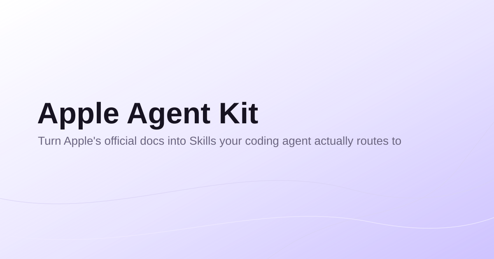

**Apple Agent Kit turns Apple's official documentation into Skills your coding agent actually routes to — so it stops guessing platform conventions and stops re-reading entire doc sets on every task.**

[](https://www.npmjs.com/package/apple-agent-kit)
[](LICENSE)
[](CHANGELOG.md)

Status: Stable
Version: 2.4.1

## See it route

```
You: Add a tab bar to my SwiftUI app for the main navigation.

Claude → loads skill.human-interface-guidelines.components
       → routes to knowledge/human-interface-guidelines/tab-bars.md
       → Rule 1: use a tab bar for top-level navigation, not in-view actions
       → Rule 5: SF Symbols icons + one-word labels
       → Rule 7: reserve badges for genuinely critical state, not routine updates

"I'll use a TabView with SF Symbols and short labels — here's the layout..."
```

No repo-wide search, no re-reading the whole HIG. One Skill, one Knowledge Contract,
traceable back to the Apple page that justifies each rule.

## What it doesn't do (yet)

Tier 1 (needed by nearly every app) and Tier 2 (common but not universal) are fully
built — 28 domains, from SwiftUI and UIKit to StoreKit, WidgetKit, and App Intents.
Tier 3 — vertical/niche frameworks like ARKit, HealthKit, GameKit, MapKit, HomeKit —
is mostly unbuilt; only Photos and Core Location have shipped so far. If your task
needs one of those, this kit won't have a Skill for it yet. Full build order:
[docs/architecture/domain-map.md](docs/architecture/domain-map.md).

## Installation

```bash
npx apple-agent-kit
```

Adds this repo as a Claude Code plugin marketplace and installs the `apple-agent-kit`
plugin — Skills, Knowledge Contracts, and routing become available inside Claude Code
sessions. Requires the `claude` CLI.

<details>
<summary>Codex CLI</summary>

The same installer detects `codex` and prints install instructions instead of
erroring. See [.codex/INSTALL.md](.codex/INSTALL.md) for the plugin-marketplace
command and a manual clone-and-symlink fallback.

</details>

## Why this exists, and how it works

AI coding agents working on Apple platform apps tend to either hallucinate platform
conventions or burn tokens re-reading entire doc sets on every task. Apple Agent Kit
pre-digests official Apple documentation into small, atomic, traceable Knowledge
Contracts, and routes an agent to exactly the ones a task needs via deterministic
Skills — never semantic search over the whole repo.

```
Apple Documentation → References → Knowledge Contracts → Skills → Workflows
```

A **Workflow** composes several Skills for a task no single domain owns. Routing
tries Workflows first — if a task spans more than one Skill a Workflow names, that
Workflow loads and sequences them; otherwise exactly one Skill loads.

- **`authentication`** — sign-in end to end: wording, form accessibility, Sign in with Apple, biometric re-auth, Keychain storage. → [WORKFLOW.md](workflows/authentication/WORKFLOW.md)
- **`app-store-submission`** — review-guideline compliance and privacy declaration, gated ahead of signing, archive, and export. → [WORKFLOW.md](workflows/app-store-submission/WORKFLOW.md)
- **`add-widget`** — widget surface, its intents, and the background refresh that keeps its timeline current. → [WORKFLOW.md](workflows/add-widget/WORKFLOW.md)

## Skills

Invoke a Skill with the concrete thing you're doing ("check this screen's layout
against HIG"), not a broad topic request ("tell me about HIG"). A sample across
framework areas:

- **`human-interface-guidelines`** — visual design: layout, color, typography, dark mode, motion. → [SKILL.md](skills/human-interface-guidelines/SKILL.md)
- **`swiftui`** — view composition, navigation, layout, state management. → [SKILL.md](skills/swiftui/SKILL.md)
- **`uikit`** — screen scaffolding: view controllers, Auto Layout, navigation. → [SKILL.md](skills/uikit/SKILL.md)
- **`accessibility`** — labels, traits, Dynamic Type, VoiceOver, audits. → [SKILL.md](skills/accessibility/SKILL.md)
- **`app-store-review-guidelines`** — submission compliance: metadata, IAP, privacy, ratings. → [SKILL.md](skills/app-store-review-guidelines/SKILL.md)
- **`storekit`** — StoreKit 2: purchase, entitlements, subscriptions. → [SKILL.md](skills/storekit/SKILL.md)
- **`widgetkit`** — declaration, timelines, interactivity, refresh. → [SKILL.md](skills/widgetkit/SKILL.md)
- **`app-intents`** — intent authoring, entities, App Shortcuts, Siri. → [SKILL.md](skills/app-intents/SKILL.md)

34 Skills total, covering everything from networking and testing to StoreKit and
Core Location. Full catalogue and routing tables: [skills/index.md](skills/index.md).

## What's New

- 2026-09-10 — **Architecture Decision Records landed.** A new, fully validated sixth artifact type, `adr` (`docs/adr/`), records *why* a domain's scope was set where it was — separately from `docs/architecture/domain-map.md`, which records only *what* the current scope is. `ADR-0001` (`style-guide`) is the first real instance; migrating the rest of `domain-map.md`'s scope history is a follow-up. Also in this release: `branding`/`layout` Knowledge Contract staleness fixes. See `CHANGELOG.md` for details.
- 2026-09-10 — **Designing for iPhone Duo support landed.** Apple published a new HIG Foundations page for its iPhone Duo (foldable) launch on 2026-09-09; `human-interface-guidelines` now routes 3 new Knowledge Contracts for it — device anatomy/poses/reserved regions, dynamic layouts (split views, arrangement views), and vertical-axis toolbar/tab bar controls. See `CHANGELOG.md` for details.
- 2026-08-23 — Codex CLI support landed. This repo's Skills are now loadable from OpenAI's Codex CLI, not just Claude Code, with zero changes to any Knowledge Contract, Skill, Reference, or Workflow — Codex reads the same `SKILL.md` files directly via a single repo-root manifest, `.codex-plugin/plugin.json`, that points at the existing `skills/` directory as a whole. No per-domain translation file exists or is needed. `.codex/INSTALL.md` documents both install paths (Codex's plugin marketplace, or a manual clone-and-symlink fallback), and `npx apple-agent-kit` now detects a Codex-only environment and prints the right instructions instead of erroring.

Only the 3 most recent entries live here — see [CHANGELOG.md](CHANGELOG.md) for the full release history.

## Contributing

Contributions are welcome — see [CONTRIBUTING.md](CONTRIBUTING.md) for how to open a PR and what a good Knowledge Contract or Skill submission looks like. Repo dev conventions (validation scripts, naming, layer order) are in [CLAUDE.md](CLAUDE.md).

## License

Source-available under the [PolyForm Strict License 1.0.0](LICENSE). You may download and use this software; you may not copy, redistribute, republish, or resell it. See [LICENSE](LICENSE) for the full terms.
